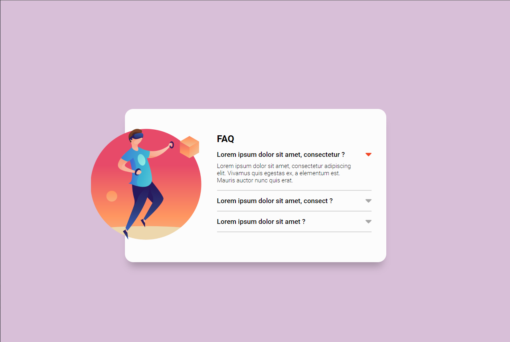
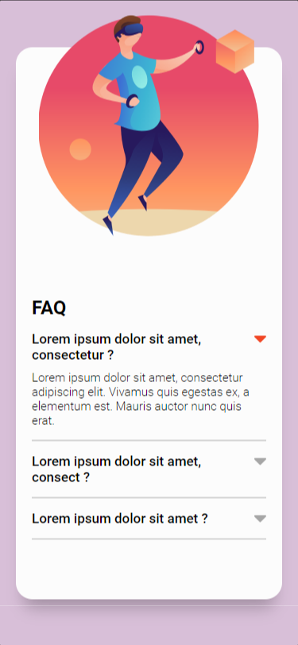
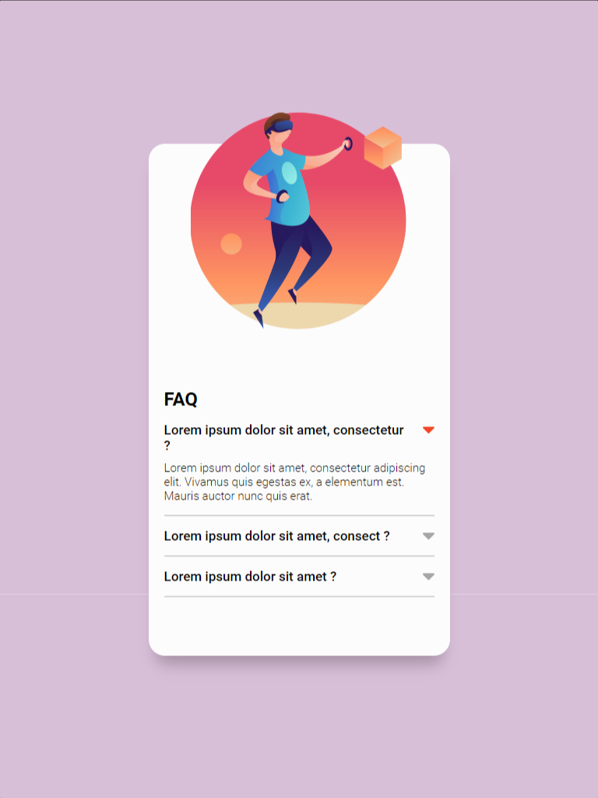

# Menu Accordion

Este é um desafio proposto no curso do [Dev em Dobro(DevQuest)](https://www.instagram.com/devemdobro)

## Índice

- [Visão geral](#visão-geral)
   - [O desafio](#o-desafio)
   - [Captura de tela](#captura-de-tela)
- [Meu processo](#meu-processo)
   - [Construído com](#construído-com)
   - [O que aprendi](#o-que-aprendi)
- [Autor](#autor)

## Visão geral

### O desafio
O desafio que foi passado pelo curso foi criar um menu accordion simples que ao clicar em uma pergunta deve acontecer uma animação de acordeon para abrir o item e mostrar o texto escondido, mas acrecentei umas coisinhas a mais como a resposividade.

Os usuários devem ser capazes de:

- Ver o layout ideal para a página, dependo do tamanho da tela de seu dispositivo
- Ao clicar na pergunta o usuario deve mostrar o texto escondido e fechar a anterior que estava clicado

### Captura de tela





## Meu processo

### Construído com

- Marcação HTML5 semântica
- Propriedades personalizadas CSS
- Flexbox
- Grid
- Metodos e funções em JavaScript para a interação
- Manipulação do DOM

### O que eu aprendi

Consegui melhorar minha logica em programação e minhas tecnicas em clean code

```js
let perguntas = document.querySelector('.perguntas')
let itens = [perguntas.children[1].children[0], perguntas.children[1].children[1], perguntas.children[1].children[2]]

itens.forEach(function(elemento) {

    elemento.addEventListener(`click`, () => {

        let itemAtual = document.querySelector(`.ativo`)

        itemAtual.children[0].children[1].children[0].classList.remove(`ativa`)
        itemAtual.children[0].children[1].children[1].classList.remove(`fechada`)
        itemAtual.children[1].classList.remove(`mostrar-txt`)

        if (elemento.classList.contains('ativo') === false) {

            itemAtual.classList.remove(`ativo`)

            elemento.classList.add(`ativo`)

            elemento.children[0].children[1].children[0].classList.add(`ativa`)
            elemento.children[0].children[1].children[1].classList.add(`fechada`)
            elemento.children[1].classList.add(`mostrar-txt`)
        } else {
            
            elemento.children[0].children[1].children[0].classList.add(`ativa`)
            elemento.children[0].children[1].children[1].classList.add(`fechada`)
            elemento.children[1].classList.add(`mostrar-txt`)
        }     
    })
})
```
## NOTA:

- Creio que ainda é possivel fazer algumas alterações no codigo de JavaScript, sendo possivel depurar o codigo e deixar bem mais compacto.
- Pontos fracos - Acho que é possivel remover a linha 2 e assim sendo possivel fazer uma ligação com todas as perguntas sem ter que adicionar ela no array, outro ponto fraco é a animação do accordeon que não consegui fazer uma transição onde o texto surge.
- Pontos Positivos - Por mais que o JavaScript dê para dar mais uma compactada, ainda é possivel entender bem a minha logica e entender o que está se passando, o menu também está bem estilazado de uma forma muito agradavel.

## Autor

- Linkedin - [Luis Fernando Macedo](https://www.linkedin.com/in/luis-fernando-macedo-7791ba219)
- Instagram - [Luis Fernando](https://www.instagram.com/luis._.fernand0_)